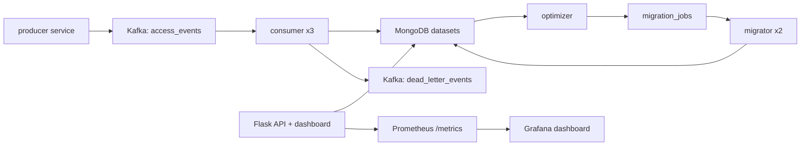

# CloudTier — Event-Driven Storage Lifecycle Optimizer

Distributed cloud data optimizer built with Kafka, MongoDB, Python workers, Prometheus, and Grafana.

CloudTier simulates cloud storage access events, consumes them through Kafka, stores dataset state in MongoDB, optimizes storage tier placement, and runs migration workers with atomic job locking and retry backoff.

## Resume Bullets

- Built CloudTier, a distributed event-driven storage optimizer with Kafka, MongoDB, Flask, Prometheus, and Docker Compose.
- Processed synthetic cloud access streams with 3 horizontally scaled consumers and idempotent MongoDB upserts keyed by `dataset_id`.
- Added atomic migration job locking, retry backoff, dead-letter handling, and duplicate-job prevention for resilient worker execution.
- Benchmarked `1,000,000` synthetic events at `78,952 events/sec`, `284M events/hour`, and `0.014 ms p95` event generation latency.
- Added `90%` pytest coverage for event validation, cost modeling, optimizer decisions, job state transitions, and malformed payload handling.

## Optimizer Logic

CloudTier uses a policy + cost model instead of fixed tier rules:

- Forecasts next-window reads and writes from recent history and trend.
- Hot or rising datasets pick only low-latency backends, then choose cheapest eligible tier.
- Cold archive datasets use storage-first scoring, so rare reads do not block cold placement.
- Warm datasets compare on-prem, private cloud, and public hot tiers.
- Hysteresis blocks tiny migrations unless savings are meaningful.
- Emergency consumer jobs use same placement engine, so real-time reactions match optimizer decisions.

## Architecture



## Services

| Service | Purpose | Scale |
| --- | --- | --- |
| `api` | Dashboard, REST API, health, metrics | 1 |
| `producer` | Synthetic dataset access stream | 1 |
| `consumer` | Kafka consumer, validates events, writes MongoDB | 3 |
| `optimizer` | Scans datasets and creates migration jobs | 1 |
| `migrator` | Atomically locks and executes migrations | 2 |
| `mongodb` | Dataset state and migration job store | 1 |
| `kafka` | Event broker | 1 |
| `prometheus` | Metrics scraping | 1 |
| `grafana` | Metrics dashboard | 1 |

## Public Interfaces

API:

- `GET /healthz`
- `GET /readyz`
- `GET /metrics`
- `GET /api/overview`
- `GET /api/datasets/<dataset_id>`
- `GET /api/migrations`
- `POST /api/analysis/full-scan`

Kafka topics:

- `access_events`
- `migration_commands`
- `dead_letter_events`

MongoDB collections:

- `datasets`
- `migration_jobs`
- `analysis_runs`
- `service_metrics`

## Run

```bash
make up
```

Open:

- Dashboard: `http://localhost:8080`
- Prometheus: `http://localhost:9090`
- Grafana: `http://localhost:3000`

Stop:

```bash
make down
```

## Test

Local setup:

```bash
python3 -m venv .venv
. .venv/bin/activate
pip install -r requirements.txt
```

```bash
make test
make lint
```

Target: `80%+` coverage.

## Benchmark

```bash
make benchmark
```

Results append to:

```text
benchmark/results.md
```

Use the generated table for resume numbers:

| Metric | Source |
| --- | --- |
| Events/hour | `benchmark/results.md` |
| p95 latency | `benchmark/results.md` |
| Consumer scale | `make up` starts 3 consumers |
| Cost savings | dashboard `/api/overview` |
| Test coverage | `make test` |

## Failure Handling

- Malformed events fail validation and go to `dead_letter_events`.
- Dataset updates are idempotent upserts keyed by `dataset_id`.
- Migration workers lock jobs with atomic `find_one_and_update`.
- Failed jobs retry with backoff until `MAX_JOB_ATTEMPTS`.
- Duplicate pending migration jobs are blocked by upsert filters.

## Configuration

| Variable | Default |
| --- | --- |
| `MONGO_URI` | `mongodb://localhost:27017/` |
| `DB_NAME` | `cloudtier` |
| `KAFKA_SERVER` | `localhost:9092` |
| `PRODUCER_DATASET_COUNT` | `1000` |
| `PRODUCER_SIM_SPEED_SEC` | `0.5` |
| `HOT_READ_THRESHOLD` | `100` |
| `COLD_READ_THRESHOLD` | `10` |
| `MAX_JOB_ATTEMPTS` | `3` |
