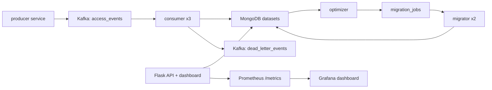

# CloudTier — Event-Driven Storage Lifecycle Optimizer

Distributed cloud data optimizer built with Kafka, MongoDB, Python workers, Prometheus, and Grafana.

CloudTier simulates cloud storage access events, consumes them through Kafka, stores dataset state in MongoDB, optimizes storage tier placement, and runs migration workers with atomic job locking and retry backoff.

## Resume Bullets

### Distributed systems / SWE

- Built CloudTier, an event-driven storage optimizer on Kafka, MongoDB, Flask, Prometheus, and Docker Compose; 3 horizontally scaled consumers use at-least-once delivery with effectively-once state via `dataset_id` upserts.
- Added lease-based leader election for 3 optimizer replicas with Mongo TTL leases and monotonic fencing tokens; measured failover min/median/max **10.4 / 10.9 / 11.4 s** over 5 induced leader kills.
- Added fencing tokens to migration job locks; live stall chaos test advanced token **1→2** and rejected the resumed stale worker's write with `cloudtier_fenced_writes_total` incrementing **1→2**.
- Quantified chaos recovery: consumer-group rebalance **14.8 s**, **0** duplicate dataset documents across **1000** datasets, **0** dead-letter events in the consumer kill scenario.
- Measured single-process event **generation** at **78,952 events/s** (`0.014 ms` p95) vs. end-to-end **pipeline** throughput at **2,082 events/s**, exposing the consumer/Mongo write bottleneck; maintained **91%** pytest coverage (bar: 80%+).

### Machine learning / explainable ML

- Reconciled the PyTorch LSTM forecaster training path so reads and writes both train 8-hour (`h8`) checkpoints and the script runs end-to-end with `python -m model.train --synthetic --epochs 3 --out-dir /tmp/cloudtier-model`.
- Kept the model out of the live migration path; the production optimizer still uses the heuristic until real-data shadow metrics prove a model improves decisions.
- Ran a SHAP sanity check on the existing synthetic `h8` checkpoints: top drivers were time-of-day/week and recent rolling history; temperature did **not** rank, so this is documented as partial explainer validation, not a clean synthetic-rule recovery.
- TODO(measure): train on real Wikipedia pageview traces, run shadow mode, run real-data SHAP, then report real model-vs-heuristic MAE/RMSE by regime. No real-data ML accuracy is claimed yet.

## Optimizer Logic

CloudTier uses a policy + cost model instead of fixed tier rules:

- Forecasts next-window reads and writes from recent history and trend.
- Hot or rising datasets pick only low-latency backends, then choose cheapest eligible tier.
- Cold archive datasets use storage-first scoring, so rare reads do not block cold placement.
- Warm datasets compare on-prem, private cloud, and public hot tiers.
- Hysteresis blocks tiny migrations unless savings are meaningful.
- Emergency consumer jobs use same placement engine, so real-time reactions match optimizer decisions.

### Cost model

Each backend has a price vector (storage, read, write, egress, latency). For a dataset the projected
hourly cost of a backend is:

```text
cost(backend) = size_gb * P_store * (hours / 720)          # prorated monthly storage
              + forecast_reads  * P_read                    # access cost
              + forecast_writes * P_write
              + forecast_reads  * P_latency * SLA_PENALTY   # latency SLA penalty (skipped for cold archive)
```

`forecast_reads`/`forecast_writes` come from the demand forecaster below. The optimizer scores every
eligible backend with this function and picks the minimum, subject to the hot-latency and
cold-archive candidate filters, then applies hysteresis before emitting a migration job.

### Demand forecasting

The live optimizer forecasts the next window from recent history with a trend ratio (mean of the
recent window vs. the prior window, clamped to a stable band) — see `shared/pricing.py:forecast_access`.
The `model/` directory additionally contains an **offline-trained PyTorch forecaster**
(`train.py`, `reads_model_h8.pth`, `writes_model_h8.pth`) — a single-target LSTM per target that
predicts summed reads/writes over an **8-hour horizon**, using the same feature shape as the heuristic
(recent/prior windows, trend ratio, size, time-of-day, day-of-week).

`model/train.py` is one coherent, runnable script (ML deps in `model/requirements.txt`):

```bash
pip install -r model/requirements.txt
python -m model.train --synthetic --epochs 3 --out-dir /tmp/cloudtier-model  # end-to-end smoke
python -m model.shap_analysis --samples 16 --background 8 --nsamples 20      # SHAP sanity check
python -m model.train --csv training_data.csv                                # real prepared data
```

Both reads and writes train at horizon 8, so the code, checkpoint names, and this README agree (an
earlier version trained reads at horizon 12 while shipping an `h8` artifact — that mismatch is fixed).
The model is trained and checkpointed but **not** wired into the live decision path; the running system
uses the heuristic. The plan is to run the model in **shadow mode** (log model vs. heuristic vs. actual
without driving migrations), not to blindly swap it in — see the Explainable-ML tasks.

## Architecture


```mermaid
flowchart LR
  Producer["producer service"] --> Kafka["Kafka: access_events"]
  Kafka --> C1["consumer x3"]
  C1 --> Mongo["MongoDB datasets"]
  C1 --> DLQ["Kafka: dead_letter_events"]
  Mongo --> Optimizer["optimizer"]
  Optimizer --> Jobs["migration_jobs"]
  Jobs --> Migrator["migrator x2"]
  Migrator --> Mongo
  API["Flask API + dashboard"] --> Mongo
  API --> Prom["Prometheus /metrics"]
  Prom --> Grafana["Grafana dashboard"]
```

## Services

| Service | Purpose | Scale |
| --- | --- | --- |
| `api` | Dashboard, REST API, health, metrics | 1 |
| `producer` | Synthetic dataset access stream | 1 |
| `consumer` | Kafka consumer, validates events, writes MongoDB | 3 |
| `optimizer` | Scans datasets and creates migration jobs (leader-elected) | 3 |
| `migrator` | Atomically locks and executes migrations | 2 |
| `mongodb` | Dataset state and migration job store | 1 |
| `kafka` | Event broker | 1 |
| `prometheus` | Metrics scraping | 1 |
| `grafana` | Metrics dashboard | 1 |

## Public Interfaces

API:

- `GET /healthz`
- `GET /readyz`
- `GET /metrics`
- `GET /api/overview`
- `GET /api/datasets/<dataset_id>`
- `GET /api/migrations`
- `POST /api/analysis/full-scan`

Kafka topics:

- `access_events`
- `migration_commands`
- `dead_letter_events`

MongoDB collections:

- `datasets`
- `migration_jobs`
- `analysis_runs`
- `service_metrics`

## Run

```bash
make up
```

Open:

- Dashboard: `http://localhost:8080`
- Prometheus: `http://localhost:9090`
- Grafana: `http://localhost:3000`

Stop:

```bash
make down
```

## Test

Local setup:

```bash
python3 -m venv .venv
. .venv/bin/activate
pip install -r requirements.txt
```

```bash
make test
make lint
```

Target: `80%+` coverage.

## Benchmark

```bash
make benchmark
```

Results append to:

```text
benchmark/results.md
```

### Generation vs. end-to-end pipeline throughput

Two different numbers, labelled distinctly, because they measure different things:

- **Event generation (single process):** `make benchmark` generates + validates events
  in one process — **~78,900 events/s** at 1M events. No Kafka, no Mongo.
- **End-to-end pipeline (produce → Kafka → consume → Mongo upsert):**
  `python -m benchmark.pipeline --window 30`, measured at the consumers via
  `cloudtier_events_processed_total` — **~2,080 events/s**.

The ~38× gap is the real cost of the pipeline: Kafka serialize/replicate/fetch plus a
MongoDB upsert with a bounded 24-point history push per event. During that run the Kafka
consumer-group lag *grew* (to ~760k and climbing), which is the honest headline: the
**consumers are the bottleneck** (Mongo write throughput), not Kafka. The right fix is
horizontal consumer scaling or a faster write path — *not* an in-process bounded queue,
which wouldn't help since Kafka already buffers broker-side and the consumers are
already draining flat out (see `SUMMARY.md`).

Use the generated table for resume numbers:

| Metric | Source |
| --- | --- |
| Events/hour | `benchmark/results.md` |
| p95 latency | `benchmark/results.md` |
| Consumer scale | `make up` starts 3 consumers |
| Cost savings | dashboard `/api/overview` |
| Test coverage | `make test` |

## Failure Handling

- Malformed events fail validation and go to `dead_letter_events`.
- Dataset updates are idempotent upserts keyed by `dataset_id`.
- Migration workers lock jobs with atomic `find_one_and_update`.
- Failed jobs retry with backoff until `MAX_JOB_ATTEMPTS`.
- Duplicate pending migration jobs are blocked by upsert filters.
- The optimizer runs 3 replicas but only the **leader** emits jobs (see below), so a
  crashed optimizer fails over automatically without producing duplicate migrations.

## Leader election & fencing

The optimizer is the one component that must not run concurrently: if three replicas
all scanned datasets and emitted jobs, they would create duplicate migrations. But
running a single replica makes it a SPOF. CloudTier resolves this with **lease-based
leader election** in MongoDB (`shared/leader.py`):

- A single `leader_lock` document holds `holder_id`, `lease_expires_at` (a wall-clock
  TTL), and a monotonic `fencing_token`.
- Acquire and renew are each one atomic `find_one_and_update`. A replica acquires only
  when the lease is unheld or expired, and renews only while it is still the holder.
  Mongo applies each update atomically to the one document, so two replicas can never
  both hold the lease.
- The `fencing_token` is incremented **only on acquisition** (a leadership change), so
  it is a monotonically increasing generation number for "who is in charge". It is the
  same mechanism used to fence stale migration writers (see below).
- Only the current leader calls `scan_once`; non-leaders idle and keep trying to
  acquire. On a leader crash, a follower takes over once the lease expires.

Each replica exports `cloudtier_optimizer_is_leader` (0/1) and
`cloudtier_optimizer_fencing_token`; the Grafana dashboard shows exactly one leader of
three and the token stepping up on each failover. `benchmark/failover.py` kills the
live leader and records real failover time in `benchmark/results.md` (measured
min/median/max **10.4 / 10.9 / 11.4 s** over 5 kills, every one failing over to a
different replica — the ~10 s floor is the lease TTL).

### Fencing tokens on migration job locks

The same fencing idea protects migration workers from the classic stalled-worker race:
migrator A locks a job, pauses (GC or network partition), its lock lease expires,
migrator B steals the job, then A wakes up and tries to write stale state. CloudTier
prevents A's stale write:

- Each job lock (`lock_next_job`) carries a `fencing_token` incremented on every
  acquisition, and a `lock_expires_at` lease. A RUNNING job whose lease has expired is
  eligible to be re-locked, and the re-lock gets a strictly higher token.
- The migration executor commits its result with a **conditional** update
  (`{_id, fencing_token: <held token>}`). If the lock was stolen (the job's token
  advanced), the update matches nothing — a no-op — and the worker skips the dataset
  write entirely. Fenced writes are counted in `cloudtier_fenced_writes_total`.

The exact interleaving (A token=1 → lease expires → B token=2 → A's write rejected →
B's write applied) is covered by `tests/test_fencing.py`.

### Chaos testing (measured recovery)

`benchmark/chaos.py` injects real faults into the live stack and records quantified
recovery in `benchmark/results.md`. Each scenario is a runnable command:

- `python -m benchmark.chaos consumer` — kill a consumer mid-load. Measured a
  **14.8 s** Kafka consumer-group rebalance and **zero duplicate dataset writes** across
  1000 datasets (redelivered messages upsert the same `dataset_id`).
- `python -m benchmark.chaos migrator` — kill a migrator mid-job. The job's lease
  expires and a second migrator re-locks (token +1) and completes it in **~32 s**
  (= the 30 s lock TTL), with zero dead-lettered jobs — at-least-once execution, no
  lost work.
- `python -m benchmark.chaos stall` — `docker pause` a migrator holding a job so a peer
  steals it (token 1→2), then unpause it: the resumed worker's stale write is **fenced**
  (`cloudtier_fenced_writes_total` +1), proving the peer's migration is never
  overwritten in a live run, not just in unit tests.

**At-least-once, deliberately.** CloudTier uses at-least-once Kafka delivery with
idempotent MongoDB upserts keyed by `dataset_id`, not Kafka transactional
exactly-once. This is a defended choice: the upserts already give *effectively-once
state* (a redelivered event overwrites the same document, proven by the zero-duplicate
chaos result above), so exactly-once would add transactional-producer/consumer
throughput cost to protect state that is already idempotent. The one thing upserts do
*not* protect — a stalled worker writing stale state after losing its lock — is closed
by fencing tokens instead, at no throughput cost on the happy path.

**Why a Mongo lease and not the alternatives:**

- **vs. Kafka partition ownership** — the natural "only one consumer per partition"
  trick doesn't apply: the optimizer scans MongoDB on a timer, it doesn't consume a
  partitioned topic, so there's no partition to own. Bolting on a dummy topic purely to
  borrow its rebalancer would be accidental complexity.
- **vs. full Raft/etcd (or ZooKeeper)** — those give a replicated consensus *log*. Here
  the requirement is only mutual exclusion plus a fencing token, not a replicated log
  or strong linearizable ordering of many operations. A single-document lease delivers
  exactly that.
- **vs. a new dependency** — Mongo is already in the stack and already the source of
  truth for dataset/job state, so leader state lives next to the data it guards and
  adds no new infrastructure to operate.

Tradeoff: correctness of the lease depends on bounded clock skew and on the TTL being
comfortably larger than the heartbeat interval (`LEADER_HEARTBEAT_SEC` ≪
`LEADER_LEASE_TTL_SEC`). The fencing token is what keeps a paused ex-leader from doing
damage if that assumption is ever violated.

## Configuration

| Variable | Default |
| --- | --- |
| `MONGO_URI` | `mongodb://localhost:27017/` |
| `DB_NAME` | `cloudtier` |
| `KAFKA_SERVER` | `localhost:9092` |
| `PRODUCER_DATASET_COUNT` | `1000` |
| `PRODUCER_SIM_SPEED_SEC` | `0.5` |
| `HOT_READ_THRESHOLD` | `100` |
| `COLD_READ_THRESHOLD` | `10` |
| `MAX_JOB_ATTEMPTS` | `3` |
| `RETRY_BACKOFF_SEC` | `3.0` |
| `JOB_LOCK_TTL_SEC` | `30.0` |
| `LEADER_LEASE_TTL_SEC` | `10.0` |
| `LEADER_HEARTBEAT_SEC` | `3.0` |
| `OPTIMIZER_SCAN_INTERVAL_SEC` | `30.0` |
| `INSTANCE_ID` | container `HOSTNAME` |
