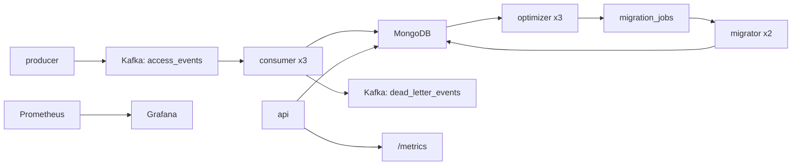

# CloudTier

CloudTier is a small event-driven storage-tier optimizer. It simulates dataset
access events, writes dataset state through Kafka consumers, periodically
evaluates cheaper storage placements, and executes migration jobs with leased
worker locks.

The project is meant to exercise the moving parts of a distributed worker
system: at-least-once delivery, idempotent MongoDB writes, leader election for a
scheduled optimizer, fenced migration jobs, metrics, and repeatable failure
tests.

## What Is Included

- Kafka event pipeline for synthetic dataset access events
- MongoDB-backed dataset state and migration job state
- Flask API and dashboard
- Optimizer workers with Mongo-backed leader election
- Migrator workers with job leases and fencing tokens
- Prometheus metrics and Grafana provisioning
- Unit tests using fakes instead of live Kafka/Mongo
- Benchmark and chaos scripts under `benchmark/`
- Offline LSTM training scripts under `model/`

## Architecture


```mermaid
flowchart LR
  Producer["producer"] --> Kafka["Kafka: access_events"]
  Kafka --> Consumer["consumer x3"]
  Consumer --> Mongo["MongoDB"]
  Consumer --> DLQ["Kafka: dead_letter_events"]
  Mongo --> Optimizer["optimizer x3"]
  Optimizer --> Jobs["migration_jobs"]
  Jobs --> Migrator["migrator x2"]
  Migrator --> Mongo
  API["api"] --> Mongo
  API --> Metrics["/metrics"]
  Prometheus["Prometheus"] --> Grafana["Grafana"]
```

## Services

| Service | Purpose | Default scale |
| --- | --- | ---: |
| `api` | dashboard, REST endpoints, health checks, metrics | 1 |
| `producer` | emits synthetic access events | 1 |
| `consumer` | validates Kafka events and upserts dataset state | 3 |
| `optimizer` | scans datasets and creates migration jobs | 3 |
| `migrator` | locks and completes migration jobs | 2 |
| `mongodb` | dataset/job storage | 1 |
| `kafka` | event broker | 1 |
| `prometheus` | metrics scraping | 1 |
| `grafana` | dashboards | 1 |

## Quick Start

```bash
cp .env.example .env
make up
```

Open:

- API/dashboard: `http://localhost:8080`
- Prometheus: `http://localhost:9090`
- Grafana: `http://localhost:3000`

Stop the stack:

```bash
make down
```

## Development

```bash
python3 -m venv .venv
. .venv/bin/activate
pip install -r requirements.txt
make lint
make test
```

`make test` runs unit tests with fake Mongo/Kafka helpers. It does not require
Docker.

## API

- `GET /healthz`
- `GET /readyz`
- `GET /metrics`
- `GET /api/overview`
- `GET /api/datasets/<dataset_id>`
- `GET /api/migrations`
- `POST /api/analysis/full-scan`

## Storage Optimizer

The optimizer uses a simple cost model instead of fixed tier rules. For each
dataset it estimates short-term reads/writes, filters eligible backends, scores
each backend, and creates a migration job only when the projected saving clears
the hysteresis threshold.

```text
cost = storage_cost + read_cost + write_cost + latency_penalty
```

Inputs used by the current live forecaster:

- recent read/write history
- prior-window history
- trend ratio with clamping
- dataset size
- backend storage/access/latency prices

The live path currently uses the heuristic in `shared/pricing.py`. The PyTorch
models in `model/` are offline artifacts and are not used for live placement
decisions.

## Reliability Notes

CloudTier intentionally uses at-least-once Kafka consumption with idempotent
MongoDB upserts keyed by `dataset_id`. A duplicate event updates the same
dataset document instead of creating a second state record.

The optimizer is scaled to three replicas, but only one replica should emit
jobs. `shared/leader.py` implements a Mongo-backed lease with a monotonic
fencing token. This avoids adding another coordination system for a single
scheduled worker role.

Migration jobs also use fencing tokens. A migrator completes a job with a
conditional update on the token it acquired. If another worker has stolen the
expired lock, the stale worker's write is rejected.

## Benchmarks And Failure Tests

Benchmark results live in `benchmark/results.md`.

Current recorded numbers include:

| Measurement | Result |
| --- | ---: |
| single-process event generation | ~78,900 events/s |
| end-to-end pipeline throughput | ~2,080 events/s |
| optimizer failover after leader kill | 10.4 / 10.9 / 11.4 s min/median/max |
| consumer rebalance after kill | 14.8 s |
| duplicate dataset documents in consumer-kill test | 0 |

Useful commands:

```bash
make benchmark
python -m benchmark.pipeline --window 30
python -m benchmark.failover --runs 5
python -m benchmark.chaos consumer
python -m benchmark.chaos migrator
python -m benchmark.chaos stall
```

The end-to-end throughput is much lower than event generation throughput because
the pipeline includes Kafka transfer and MongoDB upserts. In the recorded run,
consumer lag increased during the measurement window, so Mongo-backed consumer
throughput was the bottleneck.

## Model Experiments

The `model/` directory contains offline LSTM training and SHAP analysis scripts.
These are not wired into the running optimizer.

```bash
pip install -r model/requirements.txt
python -m model.train --synthetic --epochs 3 --out-dir /tmp/cloudtier-model
python -m model.shap_analysis --samples 16 --background 8 --nsamples 20
```

Notes:

- shipped checkpoints are horizon-8 (`reads_model_h8.pth`, `writes_model_h8.pth`)
- synthetic-model SHAP output is only a sanity check for the explainer path
- no real-data model metrics are claimed in this repo yet

## Configuration

Defaults are documented in `.env.example`. Docker Compose also sets
service-specific connection values for the in-container network.

| Variable | Default |
| --- | --- |
| `MONGO_URI` | `mongodb://mongodb:27017/` |
| `DB_NAME` | `cloudtier` |
| `KAFKA_SERVER` | `kafka:29092` |
| `PRODUCER_DATASET_COUNT` | `1000` |
| `PRODUCER_SIM_SPEED_SEC` | `0.5` |
| `HOT_READ_THRESHOLD` | `100` |
| `COLD_READ_THRESHOLD` | `10` |
| `MAX_JOB_ATTEMPTS` | `3` |
| `RETRY_BACKOFF_SEC` | `3` |
| `METRICS_PORT` | `9100` |

## Repository Layout

```text
benchmark/      benchmark and chaos scripts
model/          offline forecasting experiments
services/       runnable service entrypoints
shared/         shared pricing, event, job, leader, and metrics code
tests/          unit tests and fakes
grafana/        dashboard provisioning
prometheus/     scrape configuration
```
